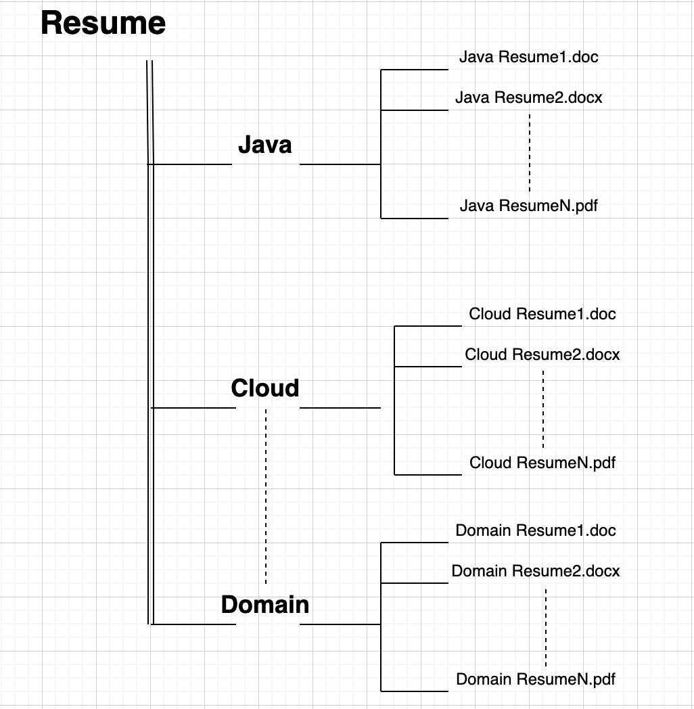

# ML Model Deployment using flask and Rest-Api

## Objective

The aim of this project is to deploy our machine learning model using flask and rest-api and, creating a basic UI using HTML and CSS to show prediction.

I have created a Resume Classification model which is trained on Logistic Regression on these four domain - Machine Learning, Java, Cloud and Big Data. The model gives the prediction on unseen resume belonging to one of the above domain with a accuracy of 92%.

**NOTE** - I have also created a package for resume classification, please check that out [here](https://pypi.org/project/resume-classification/).

## Installations

- Clone the repository.
- Install requirements.txt file - `pip install -r requirements.txt`
- Run the `main.py`.

## Guide

The project contains main.py file which is used to run all the functionality. We also have a config file where the path for various purpose is defined.

The **main.py** file contains the following function:

- train()
- predict()
- rest-api()
- api()

Our focus is on running the last two function i.e. rest-api and api.
- Run the main.py file while running the rest-api() method in it.

- The server will start.

- Hit the Url and you will see the prediction.

- Similarly to run the app, run main.py while calling api() in it.

- The server will start. Hit the Url again and it will take you to this page.

- Upload the resume and hit the submit button, you will find the prediction below.

The model is trained on some 1000 resumes on the selected domain and the pickle file of model is already present inside model folder. So if you wish to retrain the model, please follow the following steps or you can skip to the model prediction part.

### Steps to train the model

- Create a folder structure in the following manner for training on resumes.

- Run `python main.py` with function train() called inside main.py.

